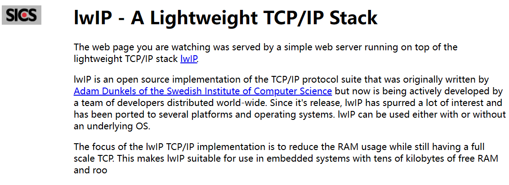

# CherryUSB RNDIS Device - Http Server(FreeRTOS)

## Overview

This example project shows USB RNDIS device implement http server

- PC sees a network interface via Device Manager, the MAC address is 20:89:84:6A:96:AA.
- Application program using lwip stack create a virtual network interface, the MAC address is 20:89:84:6A:96:00. DHCP, DNS and HTTP servers are implemented, and PC can access web pages through enumerated network interface.

## Board Setting

- Connect a USB port on PC to the PWR DEBUG port on the development board with a USB Type-C cable
- Connect a USB port on PC to one of USB port on the development board with a USB Type-C cable

## Running the example

- Download the program and run. The computer will enumerate a network interface device with the following attributes:

- Disconnect other network interface connections, keep only the enumerated network interface connections, open the Microsoft EDGE browser, and enter the web address: http://192.168.7.1 or http://rndis.hpm , the page will show as follows:

