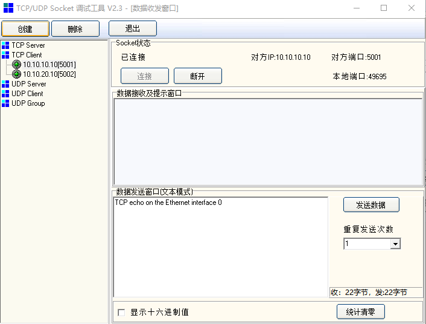
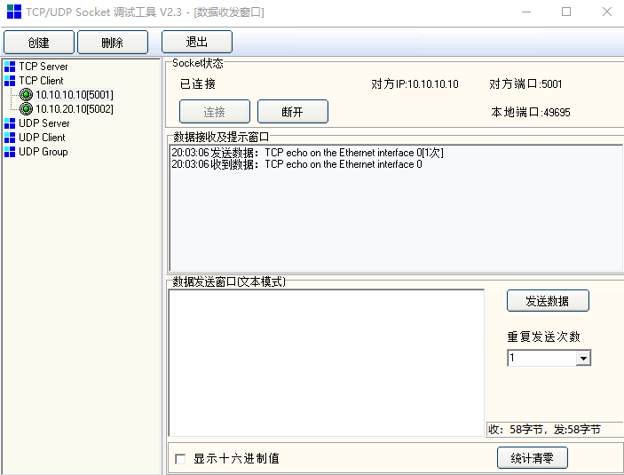

# TCP Echo On Multiple Ports

## Overview

This example shows TCP echo communication on multiple ports.

- PC sends TCP data frames to MCU,  and then MCU sends the data frames back to PC

## Board Setting

- Connect a USB port on PC to the PWR DEBUG port on the development board with a USB Type-C cable
- Connect two Ethernet ports on PC to a RGMII port and a RMII port on the development board with two Ethernet cables

## Project Configuration

- None


## Run Example

- Compiling and Downloading

- Running log is shown in the serial terminal as follows:

  ```console
  This is an ethernet demo: TCP Echo On Multiple Ports (Polling Usage)
  LwIP Version: 2.1.2
  Enet1 Reference Clock: Internal Clock
  Enet0 init passed!
  Enet1 init passed!
  ================ Network Interface 0 ================
  Static IP:  10.10.10.10
  Netmask  : 255.255.255.0
  Gateway  : 10.10.10.1
  ================ Network Interface 1 ================
  Static IP:  10.10.20.10
  Netmask  : 255.255.255.0
  Gateway  : 10.10.10.1
  ================ Network Interface 1 ================
  Link Status: Up
  Link Speed:  100Mbps
  Link Duplex: Full duplex
  ================ Network Interface 0 ================
  Link Status: Up
  Link Speed:  1000Mbps
  Link Duplex: Full duplex
  ```

- Run an Ethernet debugging tool

  - create and set two TCP clients: 
   TCP Server 0 IP: 10.10.10.10/Port: 5001 
   TCP Server 1 IP: 10.10.20.10/Port: 5002

    **Note: There is a necessary adjustment for Server IP according to the segment of  LAN where PC resides**

  - Connect

  - Enter and send any characters in the edit window(10.10.10.10)

  

  

  - Watch the characters echoed from MCU window(10.10.20.10)
  
  

  - Enter and send any characters in the edit window

  

  - Watch the characters echoed from MCU window(10.10.20.10)
  
  
