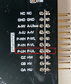

# HPM6750EVK开发板

## 概述

HPM6750是一款主频达816Mhz的双核微控制器。该芯片拥有最大2M字节的连续片上RAM，并集成了丰富的存储接口，如SDRAM，Quad SPI NOR flash， SD/eMMC卡。同时它也提供多种音视频接口包括LCD显示，像素DMA，摄像头以及I2S音频接口。

 

## 板上硬件资源

- HPM6750IVM 微控制器 (主频816Mhz, 2MB片上内存)
- 板载存储
  - 256Mb SDRAM
  - 128Mb Quad SPI NOR Flash
- 显示/摄像头
  - LCD接口
  - 摄像头(DVP)接口
- 以太网
  - 1000 Mbits PHY
  - 100 Mbits PHY
- USB
  - USB type C (USB 2.0 OTG) connector x3
- 音频
  - Line in
  - Mic
  - Speaker
  - DAO
- 其他
  - TF卡槽
  - FT2232
  - 蜂鸣器
  - RGB LED
  - CAN
- 扩展口
  - 电机控制

## 拨码开关 S1

- Bit 2，3控制启动模式

| Bit[2:3] | 功能描述                |
| -------- | ----------------------- |
| OFF, OFF | Quad SPI NOR flash 启动 |
| OFF, ON  | 串行启动                |
| ON, OFF  | 在系统编程              |

- Bit 1用于选择PWM或是千兆网口

| Bit[1] | 功能描述 |
| ------ | -------- |
| OFF    | 千兆网口 |
| ON     | PWM      |

(lab_hpm6750_evk_board)=

## 按键

(lab_hpm6750_evk_board_buttons)=

| 名称        | 功能                                  |
| ----------- | ------------------------------------- |
| PBUTN (S2)  | 电源按键, TinyUF2 Boot按键, GPIO 按键 |
| WBUTN (S3)  | WAKE UP 按键                          |
| RESETN (S4) | Reset 按键                            |

## 引脚描述

- PWM引脚

  | Function | Position |
  | -------- | -------- |
  | PWM2.P0  | J12[14]  |
  | PWM2.P1  | J12[13]  |

  
- SPI引脚：

| 功能      | 位置    |
| --------- | ------- |
| SPI2.CSN  | J20[7]  |
| SPI2.SCLK | J20[8]  |
| SPI2.MISO | J20[9]  |
| SPI2.MOSI | J20[10] |

- I2C引脚：

| 功能     | 位置   |
| -------- | ------ |
| I2C0.SCL | J20[3] |
| I2C0.SDA | J20[4] |

- CORE1调试串口引脚：

| 功能       | 位置   |
| ---------- | ------ |
| UART13.TXD | J20[5] |
| UART13.RXD | J20[6] |

- ACMP引脚

| 功能       | 位置   |
| ---------- | ------ |
| CMP.INN6   | J12[8] |
| CMP.COMP_1 | J12[6] |

- GPTMR引脚

| 功能          | 位置   |
| ------------- | ------ |
| GPTMR4.CAPT_1 | J12[6] |
| GPTMR5.COMP_2 | J12[18] |
| GPTMR5.COMP_3 | J12[16] |

- ADC12引脚

| 功能              | 位置   |
| ----------------- | ------ |
| ADC12参考电压设置 | 无     |
| ADC0/1/2.VINP11   | J12[6] |
| ADC0/1/2.VINP10   | J12[7] |
| ADC0/1/2.VINP7    | J12[8] |

- ADC16引脚

| 功能              | 位置   |
| :---------------- | ------ |
| ADC16参考电压设置 | 无     |
| ADC3.INA2         | J12[5] |

- 耳机接口

| 功能          | 位置 | 标准 |
| ------------- | ---- | ---- |
| 3.5mm耳机接口 | J14  | CTIA |

- 音频输入接口

| 功能            | 位置 |
| --------------- | ---- |
| 3.5mm音频线输入 | J17  |

- DAO接口

| 功能     | 位置 |
| -------- | ---- |
| 喇叭接口 | J18  |

- 以太网PPS信号引脚

| 功能        | 位置   |
| ----------- | ------ |
| ENET0.EVTO0 | U29[2] |

- UART引脚用于uart_software_rx_idle或uart_rx_timeout或uart_lin工程

| 功能       | 位置   |
| ---------- | ------ |
| UART13.TXD | J20[5] |
| UART13.RXD | J20[6] |

- TRGMUX引脚用于uart_software_rx_idle工程

| 功能        | 位置    |
| ---------- | -------- |
| TRGM2_P9(PD19)  | J12[20]   |

- 电机引脚

  参考 [DRV-LV50A-MP1907 电机驱动板章节](lab_drv_lv50a_mp1907) 进行连接
