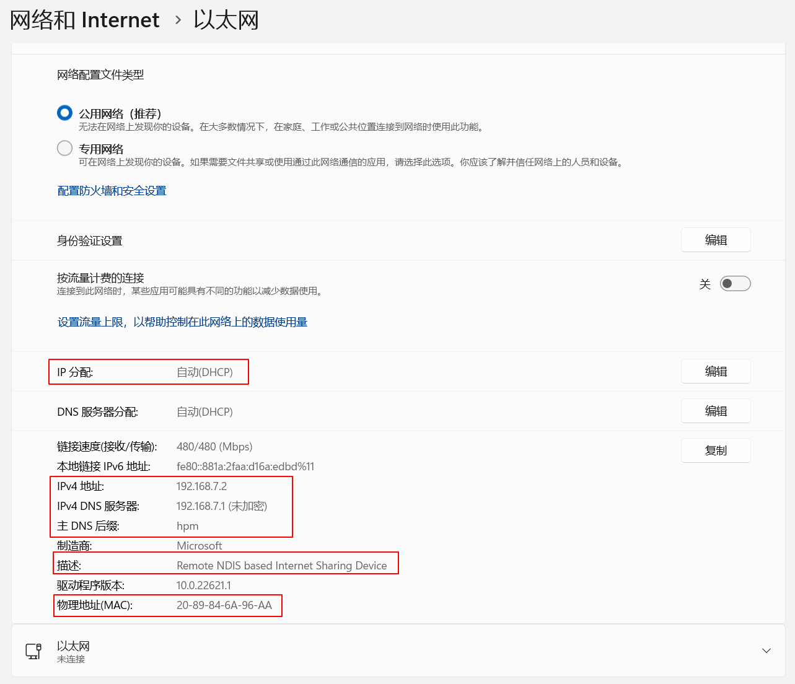
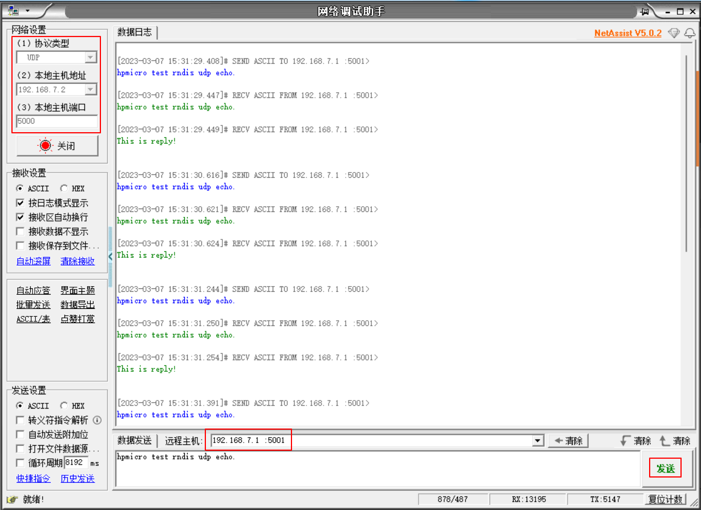

# CherryUSB RNDIS Device - UDP Echo

## 概述

本示例工程展示USB RNDIS设备实现UDP Echo。

- PC 通过设备管理器查看得到一个枚举的网口，MAC地址为20:89:84:6A:96:AA。
- 应用程序使用LWIP协议栈虚拟出了一个网口，MAC地址为20:89:84:6A:96:00，IP地址为192.168.7.1。实现了DHCP、DNS和UDP服务器，PC枚举出来的网口可通过UDP协议与虚拟出来的网口进行通讯。

## 硬件设置

- 使用USB Type-C线缆连接PC USB端口和PWR DEBUG端口
- 使用USB Type-C线缆连接PC USB端口和开发板USB0端口

## 运行现象

- 将程序下载至开发板运行，电脑将枚举出一个网口设备，属性如下：


- 打开网络调试助手，设置如下(远程主机IP为192.168.7.1，端口为5001)，输入字符串后点击发送，远程主机将会返回收到的字符串，并输出“This is reply!”。


- 同时，也可观测串口控制台输出，对应输出如下：
```console

Udp_server get a data:
hpmicro test rndis udp echo.
This is reply!
Udp_server get a data:
hpmicro test rndis udp echo.
This is reply!

```
