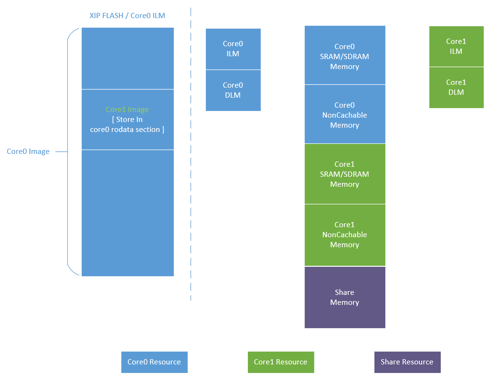

# Multicore 通用说明

## 概述

Core0 和 Core1 是两个独立的Core，每个Core有自己内部独立的资源，例如ILM/DLM、PLIC、MCHTMR、FGPIO、PMP/PMA等；二者也有SOC共享的外设资源，例如AXI_SRAM、UART、DMA等。在双核设计时，需要规划好内存资源和外设资源的分配。

系统总是从Core0启动，Core1不能自启动，因此Core0为主核，Core1为从核。Core0启动后，会对SOC的基础资源进行初始化，例如时钟、内存、电源等，之后指定Core1的启动地址并释放Core1，这样双核就运行起来了。

## 内存分配

本系列双核示例，内存的组织示意图如下：

- Core0: 具有ILM、DLM、XIP Flash、SRAM/SDRAM、NonCacheable内存和一段与Core1共享的内存。代码在ILM或XIP Flash中运行，数据在DLM或SRAM/SDRAM中。

- Core1: 具有ILM、DLM、SRAM/SDRAM、NonCacheable内存和一段与Core0共享的内存。代码在ILM中运行，数据在DLM或SRAM/SDRAM中。

## Core1代码存放位置

本系列双核示例Core1的linker文件并没有链接到Flash中，那它的代码是如何存储的呢？

我们目前的组织方式是Core1编译完毕后，会自动通过 **bin2c.py** 脚本将Core1的bin文件生成 **sec_core_img.c** 文件，同时该文件会自动复制到 **Core0** 的Project下，因此编译 **Core0** 时，就包含了 **Core1** image信息。Core1 image内容会编译进Core0的 **.rodata** 段中，如上述内存的组织示意图所示。

Core0在启动时，会将 **sec_core_img.c** 里面的内容复制到Core1的ILM中，然后指定Core1的启动地址为ILM并释放Core1，这样Core1就运行起来了。

## 生成工程

- 用户使用Cmake生成Core0 Project时，会自动关联生成Core1 Project。

- 生成Core1 Project之后，会自动使用 ***RISC-V GCC*** 工具链对Core1 Project进行编译。这点需特别注意！

- Core1 Project编译完毕后，会自动使用 **bin2c.py** 脚本将该bin文件转换生成 **sec_core_img.c** 文件，并复制到Core0的Project下。

- 此时，Core0和Core1的Project都生成了，并且Core1 Project已使用RISC-V GCC工具链编译产生了image。

- 注意：

  - 若关联的Core1 Project生成或编译失败，则Core0 Project也无法生成。此时，用户可以单独生成或编译Core1 Project，以排查Core1 Project的相关问题。待问题解决后，再重新生成Core0 Project。

## 编译工程

- 首先，编译Core1 Project
  - 由于Core1 Project自动编译使用的是RISC-V GCC工具链，若用户需要使用Segger Embeded Studio的工具链，则用Segger Embeded Studio打开Core1 Project并执行编译。

- 然后，编译Core0 Project
  - 若用户需要使用Segger Embeded Studio的工具链，则用Segger Embeded Studio打开Core0 Project并执行编译。

- 注意：
  - 当对Core1 Project的文件进行了更新，重新编译Core1 Project后，会自动更新Core0 Project下的**sec_core_img.c** 文件，因此必须要重新编译Core0 Project，以更新Core1 Image的内容。

## 调试示例
- 分别打开生成的Core0 Project和Core1 Project。
- 先编译Core1示例，再编译Core0示例。
- 下载core0示例到设备中，点击Run。
- 下载core1示例到设备中，点击Run。
- 注意：
  - 调试时，用户须先跑Core0，再跑Core1。因为Core0会先对时钟、电源等进行初始化。

## 下载运行
- 当用户无需调试时，只需将Core0的elf或bin文件下载到到设备的Flash中，然后断开调试，按板子上的reset键即可运行双核程序。因为 __core0__ 编译生成的elf或bin文件包含了 __core1__ image的内容。
