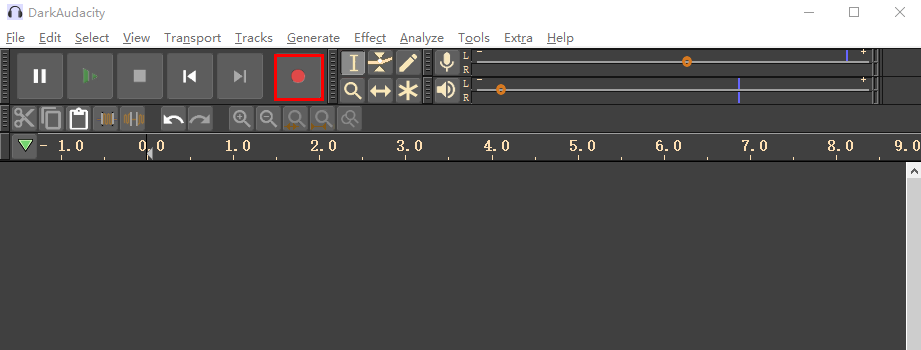
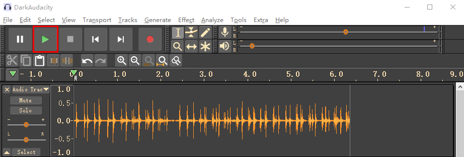

# UAC2 扬声器/麦克风

## 概述

本示例工程展示USB UAC2 扬声器和麦克风的功能

- PC 通过USB 发送音频数据，MCU接收后通过DAO播放

## 硬件设置

* 使用USB Type-C线缆连接PC USB端口和PWR DEBUG端口
* 使用USB Type-C线缆连接PC USB端口和开发板USB0端口或者USB1端口
* 将扬声器连接至DAO接口上

## 工程配置

- 文件 `CMakeLists.txt`中设置BOARD_DEVICE_RHPORT_NUM为0或1，0表示USB0, 1表示USB1
- USB device 属性可通过tusb_config.h或CMakeListx.txt配置

## 运行现象

当工程正确运行后

* 确认audio属性设置

  (1)  选择"TinyUSB headset"为播放设备

  

  （2） 选择"TinyUSB headset" 为录音设备

  

- 播放

  ​	（1） 打开PC音乐播放器，选择一首歌曲，点击“播放”按钮

  ​	  

  ​    （2） MCU收到音频数据后，会同步通过扬声器播放出来

- 录音

  ​     （1）关闭PC音乐播放器

  ​     （2）打开录音工具，点击“录音”按钮，同时通过其他播放设备播放音乐（比如：手机）

  

  ​	 （3）持续一段时间后，点击"停止"按钮

  

  ​     （4）点击"播放"按钮

  

  ​     （5）MCU通过DAO接口的扬声器播放出来自PC的音频

  ​      

